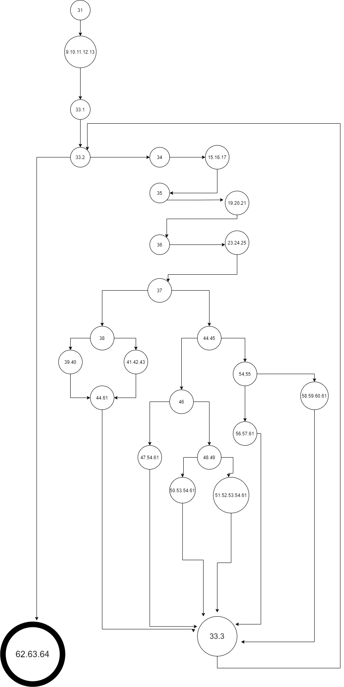
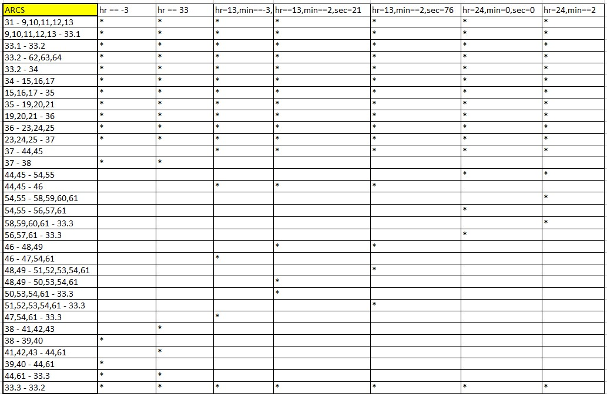
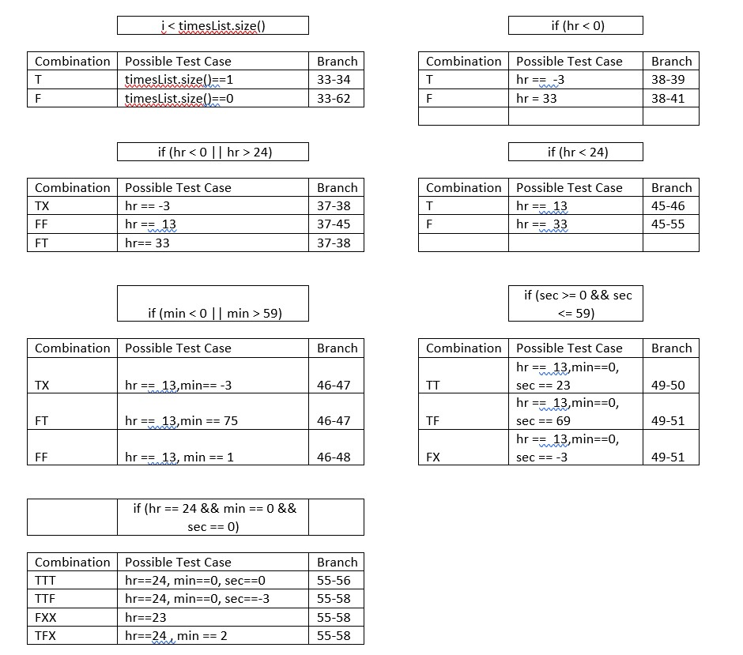

# Втора лабораториска вежба по Софтверско инженерство

## Ќамил Какалески, бр. на индекс 195018

###  Control Flow Graph

CFG е граден според линиите од кодот SILab2.java

### Цикломатска комплексност

Цикломатската комплексност на овој код е 8, истата ја добив преку формулата P+1, каде што P е бројот на предикатни јазли. Во случајoв P=7, па цикломатската комплексност изнесува 8. Ги испробав и останатите две формули за E-N+2, и Бројот на региони(вкупниот) и сте беа 8 на крајот.

### Тест случаи според критериумот Every branch

Со методот на Every branch ги поминува сите ребра(edges) во графот. Соодветно секое ребро треба да помине барем еднаш, односно да помине успешно тестот. Тест cases се задаваат, а секоја гранка се гледа дали ќе може да ги изврши.

### Тест случаи според критериумот  Multiple Conditions 

  

Со методот на multiple conditions ги земаме за тестирање само if условите(else if исто така) и ги објаснуваме нивните однесувања при одредени test cases и нивните комбинации според тоа како се градени пример ако има конјукција во if условот од променливи( hr == 24 && min == 0 && sec == 0) тогаш правиме true false комбинации за сите три, ТTT=True->hr==24, True-> min==0, True-> sec==0.

### Објаснување на напишаните unit tests
    @Test
    public void test1() {
        ###//Every branch / Multiple Condition if(i < timesList.size()) -> T, (hr < 0 || hr > 24)->TX
        ###//Multiple condition if(hr < 0)->T
        Time time = new Time(-3,10,20);
        List<Time> TimesList = new ArrayList<>();
        TimesList.add(time);
        try {
            SILab2.function(TimesList);
        } catch (Exception e){
            assertEquals(e.getMessage(),"The hours are smaller than the minimum");
        }
    }

    @Test
    public void test2() {
        ###//Everybranch/ Multiple conditions if(hr < 0 || hr > 24) -> FT
       ### //Multiple condition if(hr<0) -> F
        Time Time = new Time(33,10,20);
        List<Time> TimesList = new ArrayList<>();
        TimesList.add(Time);
        try {
            SILab2.function(TimesList);
        } catch (Exception e){
            assertEquals(e.getMessage(),"The hours are grater than the maximum");
        }
    }

    @Test
    public void test3() {
        ###//Every branch/ multiple condition if(hr<0 || hr > 24) -> FF
        ###//Multiple condition if(min<0 || min>59) -> FT
       ### //Multiple condition if(hr<24) ->T, if(min < 0 || min > 59) -> TX
        Time Time = new Time(13,-3,25);
        Time Time2 = new Time(13,85,-3);
        List<Time> TimesList = new ArrayList<>();
        TimesList.add(Time);
        TimesList.add(Time2);
        try {
            SILab2.function(TimesList);
        } catch (Exception e){
            assertEquals(e.getMessage(),"The minutes are not valid!");
        }
    }

    @Test
    public void test4() {
        ###//Every branch/Multiple condition if(min < 0 || min > 59) FF
        ###// Multiple condition if(sec >= 0 && sec <= 59) -> TT
        Time Time = new Time(13,2,21);
        List<Time> TimesList = new ArrayList<>();
        List<Integer> result = new ArrayList<>();
        TimesList.add(Time);
        result = SILab2.function(TimesList);
        assertEquals(result.get(0).intValue(),Time.getHours()*3600 + Time.getMinutes()*60 + Time.getSeconds());
    }

    @Test
    public void test5() {
        ###//Every branch & Multiple condition if(sec >= 0 && sec <= 59) -> TF
        ###//Multiple condition if(sec >= 0 && sec <= 59) FX
       ### //Multiple condition if(hr == 24 && min == 0 && sec == 0) ->FXX
        Time Time = new Time(13,2,76);
        Time Time2 = new Time(13,0,-3);
        List<Time> TimesList = new ArrayList<>();
        TimesList.add(Time);
        TimesList.add(Time2);
        try {
            SILab2.function(TimesList);
        } catch (Exception e){
            assertEquals(e.getMessage(),"The seconds are not valid");
        }
    }

    @Test
    public void test6() {
        ###//Every branch & Multiple Condition if(hr < 24) -> F
        ###// Multiple condition if(hr == 24 && min == 0 && sec == 0) -> TTT
        Time Time = new Time(24,0,0);
        List<Time> TimesList = new ArrayList<>();
        List<Integer> result = new ArrayList<>();
        TimesList.add(Time);
        result = SILab2.function(TimesList);
        assertEquals(result.get(0).intValue(),Time.getHours()*3600 + Time.getMinutes()*60 + Time.getSeconds());
    }

    @Test
    public void test7() {
        ###//Every branch & Multiple condition if(hr == 24 && min == 0 && sec == 0) -> TTF,
        ###//and mulitple condition for if(hr == 24 && min == 0 && sec == 0) -> TFX
        Time Time = new Time(24,2,0);
        Time Time2 = new Time(24,0,-3);
        Time Time3 = new Time(24,85,1);
        List<Time> TimesList = new ArrayList<>();
        TimesList.add(Time);
        TimesList.add(Time2);
        TimesList.add(Time3);
        try {
            SILab2.function(TimesList);
        } catch (Exception e){
            assertEquals(e.getMessage(),"The time is greater than the maximum");
        }
    }
    ###//Multiple Condtion кои не беа опфатени во претходниот критериот Every branch од test1-test7
    @Test
    public void test8() {
        //i < timesList.size() --> F with Multiple condition
        List<Time> TimesList = new ArrayList<>();
        List<Integer> result = new ArrayList<>();
        result = SILab2.function(TimesList);
        assertEquals(result.size(),0);
    }

Погоре ги гледаме jUnit тестовите кои некои се комбинација за Every branch критериумот и за Multiple condition поради
оптимизација.
##### ЗА ТЕСТ 1
Се проверуваше дали условот во самиот for е задоволен и исто така
и првите два if
##### ЗА ТЕСТ 2
Се проверуваше што ќе се случи ако условот hr<24 падне, а во исто време помине и 
условот if(hr == 24 && min == 0 && sec == 0).
##### ЗА ТЕСТ 3
Тука проверуваме условот if(hr<0 || hr > 24) да падне со доделување соодветни test cases за да се случи fail
Соодветно ги проверуваме if(min<0 || min>59) со што првото да е точно второто не
и последниот if(min < 0 || min > 59) каде не интересира само едно од min да биде помало од 0 или поголемо од 59
##### ЗА ТЕСТ 4
Тука се проверува if(min < 0 || min > 59) со цел да fail-нат и двата случаја односно обратно од претходниот test, test3
##### ЗА ТЕСТ 5
Во овој test case if(sec >= 0 && sec <= 59) да го направиме true и false со давање на test cases различни од тиа што го
задоволуваат if-от
##### ЗА ТЕСТ 6
Тука сакавме да падне првиот услов hr<24, но во исто време можеме да тестираме и конјуктивниот if со 24 за час и нули
за минута и секунда соодветно
##### ЗА ТЕСТ 7
Ова е најголемиот test каде се задоволуваат 3 теста, пад на if(hr == 24 && min == 0 && sec == 0)
##### ЗА ТЕСТ 8
Последниот 8 тест, проверува што ќе се случи ако не се задоволи условот во for уште на почетокот, односно дали 
ќе направи return result, и истата ќе биде 0/Null.
